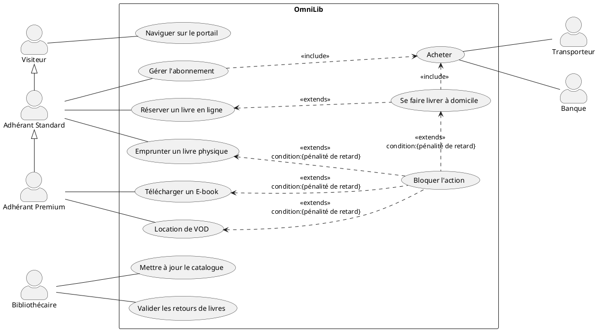
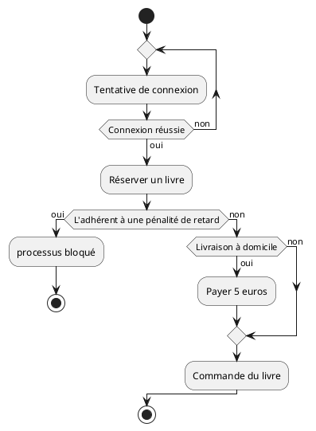

# OmniLib

Modélisation UML du projet OmniLib - portail unique capable de gérer à la fois le stock physique historique et numérique de médias

## Diagramme de cas d'utilisation

### Code du diagramme

### rendu du diagramme de cas d'utilisation

## Diagramme d'activité 

### Code du diagramme d'activités pour réserver un livre en ligne

### rendu du diagramme d'activités

